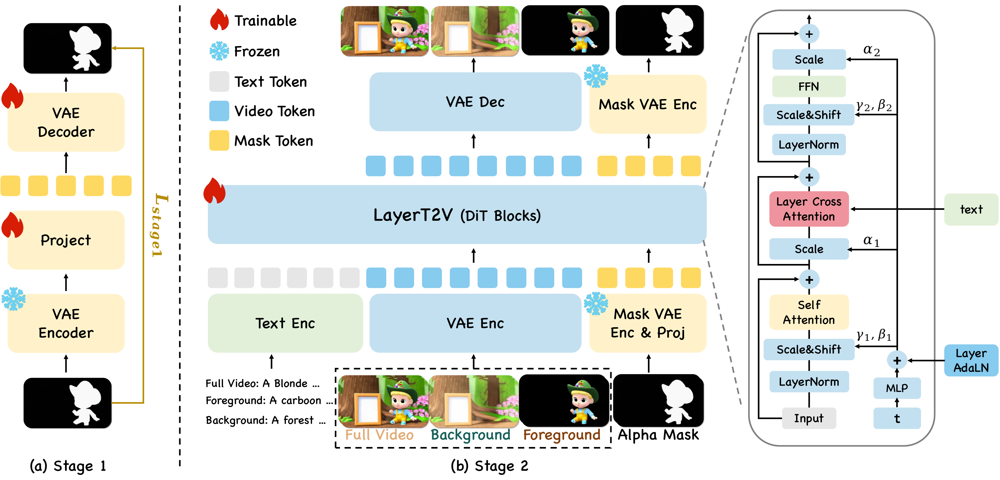

<p align="center">
  <h1 align="center">LayerT2V: A Unified Multi-Layer Video Generation Framework</h1>
</p>

<p align="center">
  <strong>Guangzhao Li<sup>*</sup></strong>
  ·
  <strong>Kangrui Cen<sup>*</sup></strong>
  ·
  <strong>Baixuan Zhao</strong>
  ·
  <strong>Yi Xin</strong>
  ·
  <strong>Siqi Luo</strong>
  ·
  <strong>Guangtao Zhai</strong>
  ·
  <strong>Lei Zhang</strong>
  ·
  <strong>Xiaohong Liu</strong>
  <br>
  <br>
  <a href="https://arxiv.org/abs/2508.04228"></a>
  <a href="https://layert2v.github.io/"></a>
  <a href="https://arxiv.org/abs/2508.04228"></a>
  <a href="LICENSE.txt"></a>
</p>

<p align="center">
  
  <br>
  <em>LayerT2V jointly generates a composited video, background layer, foreground RGB layers, and alpha mattes in a unified video generation trajectory.</em>
</p>

---

This is the official repository for **LayerT2V: A Unified Multi-Layer Video Generation Framework**.

## 📄 Abstract

**TL;DR:** LayerT2V generates an editable layered video representation in one inference pass, including the full video, background, foreground RGB layers, and alpha mattes.

<details>
<summary>Click to read the full abstract</summary>

Text-to-video generation has advanced rapidly, but existing methods typically output only the final composited video and lack editable layered representations, limiting their use in professional workflows. We propose **LayerT2V**, a unified multi-layer video generation framework that produces multiple semantically consistent outputs in a single inference pass: the full video, an independent background layer, and multiple foreground RGB layers with corresponding alpha mattes. Our key insight is that recent video generation backbones use high compression in both time and space, enabling us to serialize multiple layer representations along the temporal dimension and jointly model them on a shared generation trajectory. This turns cross-layer consistency into an intrinsic objective, improving semantic alignment and temporal coherence. To mitigate layer ambiguity and conditional leakage, we augment a shared DiT backbone with LayerAdaLN and layer-aware cross-attention modulation. LayerT2V is trained in three stages: alpha mask VAE adaptation, joint multi-layer learning, and multi-foreground extension. We also introduce **VidLayer**, the first large-scale dataset for multi-layer video generation. Extensive experiments demonstrate that LayerT2V substantially outperforms prior methods in visual fidelity, temporal consistency, and cross-layer coherence.

</details>

---

## 🌟 Key Features

- **Unified multi-layer generation:** Produces the full video, background, foreground RGB layers, and alpha mattes in one inference pass.
- **Layer-aware diffusion modeling:** Serializes layer representations along the temporal dimension and models them jointly.
- **Layer-specific conditioning:** Uses LayerAdaLN and layer-aware cross-attention modulation to reduce layer ambiguity.
- **Editable video representation:** Generates explicit foreground/background layers for downstream editing and compositing.
- **VidLayer dataset:** Introduces a large-scale dataset designed for multi-layer video generation.

---

## 🔥 News

- **[2026.05]** LayerT2V is accepted to ICML.
- **[2026.02]** We updated the arXiv version of LayerT2V.
- **[2025.08]** We released the LayerT2V preprint on arXiv.

---

## 📑 Todo

- [x] Release the initial codebase.
- [x] Release the project page.
- [x] Release the arXiv paper.
- [ ] Release pretrained LayerT2V checkpoints.
- [ ] Release VidLayer dataset resources.
- [ ] Add detailed evaluation scripts and instructions.

---

## 🚀 Getting Started

### ⚙️ Installation

```bash
git clone https://github.com/guangzhaoli/LayerT2V.git
cd LayerT2V

conda create -n layert2v python=3.10
conda activate layert2v

pip install -r requirements.txt
```

For training, install the training dependencies as needed:

```bash
pip install -r requirements_training.txt
```

### 📦 Model Preparation

LayerT2V builds on Wan2.1 video generation components. Prepare the required Wan2.1 base checkpoint locally and pass its path through `--model_path`.

Pretrained LayerT2V checkpoints and VidLayer dataset release links will be added after release preparation is complete.

---

## 🎬 How to Use

### 🧪 Inference

Use the provided inference script for layered video generation:

```bash
bash scripts/run_inference.sh \
  --model_path /path/to/Wan2.1-T2V-1.3B \
  --lora_path /path/to/layert2v/checkpoint \
  --prompt "A ship sails on the ocean under blue sky." \
  --fg_prompt "A ship." \
  --bg_prompt "A vast ocean under blue sky." \
  --output_dir outputs/demo
```

Useful options include:

- `--mask_mode`: mask processing mode, such as `vae`, `downsample`, `vae-project`, `mask-vae-project`, or `mask-vae-joint`.
- `--mask_vae_path`: MaskVAE checkpoint path for MaskVAE-based modes.
- `--mask_vae_proj_path`: projection checkpoint path for projection-based modes.
- `--use_4d_rope` / `--no_4d_rope`: switch between 4D layer-temporal-spatial RoPE and original 3D RoPE.
- `--width`, `--height`, `--frames`, `--steps`, `--seed`: generation controls.

### 🏋️ Training

Use the training script with a config file, Wan2.1 checkpoint, and dataset root:

```bash
bash scripts/run_train.sh \
  --config training/configs/train.yaml \
  --num_gpus 4 \
  --model_path /path/to/Wan2.1-T2V-1.3B \
  --data_root /path/to/VidLayer \
  --output_dir outputs/train
```

The training code supports the main LayerT2V stages, including alpha mask VAE adaptation, joint multi-layer learning, and multi-foreground extension.

---

## 🗂️ Repository Structure

```text
LayerT2V
├── generate.py
├── inference_res.py
├── scripts/
├── training/
├── vis_scripts/
└── wan/
```

- `wan/`: Wan2.1-based generation modules and LayerT2V inference implementation.
- `training/`: training datasets, configs, and training entrypoints.
- `scripts/`: launch scripts for inference, training, batch inference, and experiment utilities.
- `vis_scripts/`: visualization utilities for generated layer outputs.

---

## 📝 Citation

If you find LayerT2V useful for your research, please cite our paper:

```bibtex
@misc{li2026layert2vunifiedmultilayervideo,
      title={LayerT2V: A Unified Multi-Layer Video Generation Framework}, 
      author={Guangzhao Li and Kangrui Cen and Baixuan Zhao and Yi Xin and Siqi Luo and Guangtao Zhai and Lei Zhang and Xiaohong Liu},
      year={2026},
      eprint={2508.04228},
      archivePrefix={arXiv},
      primaryClass={cs.CV},
      url={https://arxiv.org/abs/2508.04228}, 
}
```

The citation will be updated after the official proceedings information becomes available.

---

## 🙏 Acknowledgments

LayerT2V is implemented based on [Wan2.1](https://github.com/Wan-Video/Wan2.1). We sincerely thank the Wan2.1 team for their excellent open-source video generation framework.

We also thank everyone who supports this project. More details will be added together with future releases.

## 📬 Contact

For questions, please open an issue in this repository.
